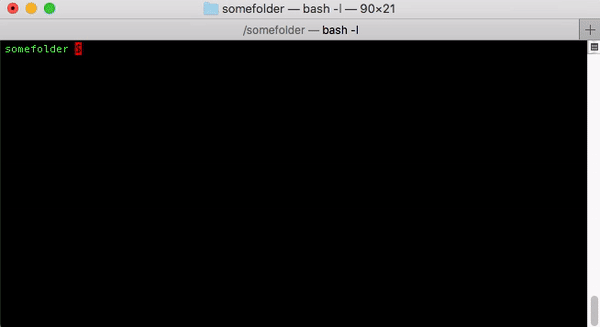
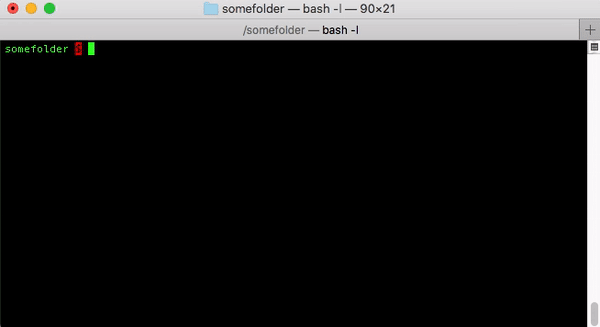

# Collection working with bash_profile

Collection of bash / sh / cli snippets, commands and tools working with bash_profile


### Reload profile

Reload bashrc / bash_profile without logging out and back in

```bash
exec bash -l
```


### Aliases

#### Aliaser

[Tool](aliaser.sh) helps add / remove alias to bash_profile file

```bash
./aliaser.sh [<no_flags>|-a|--add|-r|--remove|-h|--help] <full_script_path_to_target_file>
```

###### Help

```bash
./aliaser.sh [-h|--help]
```


###### Add

```bash
./aliaser.sh [<no_flags>|-a|--add] <full_script_path_to_target_file>
```


###### Remove

```bash
./aliaser.sh [-r|--remove] <full_script_path_to_target_file>
```



#### Self-register snippet

Automaticly register aliases to bashrc / bash_profile.
This snippet could be added to any script to add auto-register alias functionality.

Steps:
- add snippet to your bash file
- run via `./script.sh -i` and fill required data
- reload terminal session and enjoy new alias

```bash
#################### Auto-registerer

PARAM_INSTALL_OPTION="-i"
SELF_SCRIPT_PATH="${BASH_SOURCE[0]}"
SELF_SCRIPT_FILENAME=`basename "${SELF_SCRIPT_PATH}"`

function autoRegisterer()
{
    local FILE_BASH_PROFILE=$1
    local ALIAS=$2

    if [[ ! -f "${FILE_BASH_PROFILE}" ]]; then
        touch "${FILE_BASH_PROFILE}"
    fi

    local LABEL_START="### auto-registered ${SELF_SCRIPT_FILENAME} >>>"
    local LABEL_END="### auto-registered ${SELF_SCRIPT_FILENAME} <<<"

    if grep -Fxq "${LABEL_START}" "${FILE_BASH_PROFILE}" && grep -Fxq "${LABEL_END}" "${FILE_BASH_PROFILE}"; then
        echo "Auto-registered sections already exist"
        exit
    else
        sh -c "cat >> ${FILE_BASH_PROFILE}" <<EOT

${LABEL_START}
alias ${ALIAS}="${SELF_SCRIPT_PATH}"
${LABEL_END}
EOT
    fi
}

########## Main

if [[ -n "${BASH_VERSION}" ]] && [[ "$1" == "${PARAM_INSTALL_OPTION}" ]]; then
    read -p "Pls, check you HOMEDIR [${HOME}]: " HOME_DIR
    HOME_DIR="${HOME_DIR:-"${HOME}"}"
    DEFAULT_ALIAS="${SELF_SCRIPT_FILENAME%.*}"
    read -p "Pls, check alias you wanted to link with [${DEFAULT_ALIAS}]: " ALIAS
    ALIAS=${ALIAS:-${DEFAULT_ALIAS}}

    FILE_BASH_PROFILE=".bashrc"
    if [[ "$OSTYPE" == "darwin"* ]]; then
        FILE_BASH_PROFILE=".bash_profile"
        echo "MacOS was detected"
    fi
    FILE_BASH_PROFILE="${HOME_DIR}/${FILE_BASH_PROFILE}"

    autoRegisterer "${FILE_BASH_PROFILE}" "${ALIAS}"
    echo "Auto-registration at file '${FILE_BASH_PROFILE}' has been completed!"
    echo "Don't forget to reload shell e.g. '. ${FILE_BASH_PROFILE}'"

    exec bash -l

    exit 0;
fi

#################### Auto-registerer

```


### Create function or caller

Use function or caller to run some dynamic scripts with params having some logic inside.
Add follow to `bash_profile`

```bash
callerName() {
echo "$1" "$2"
}
```
